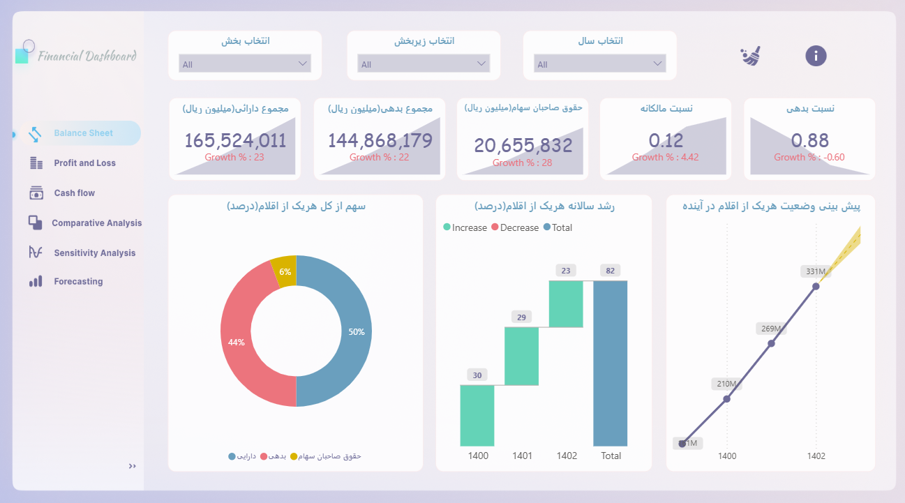
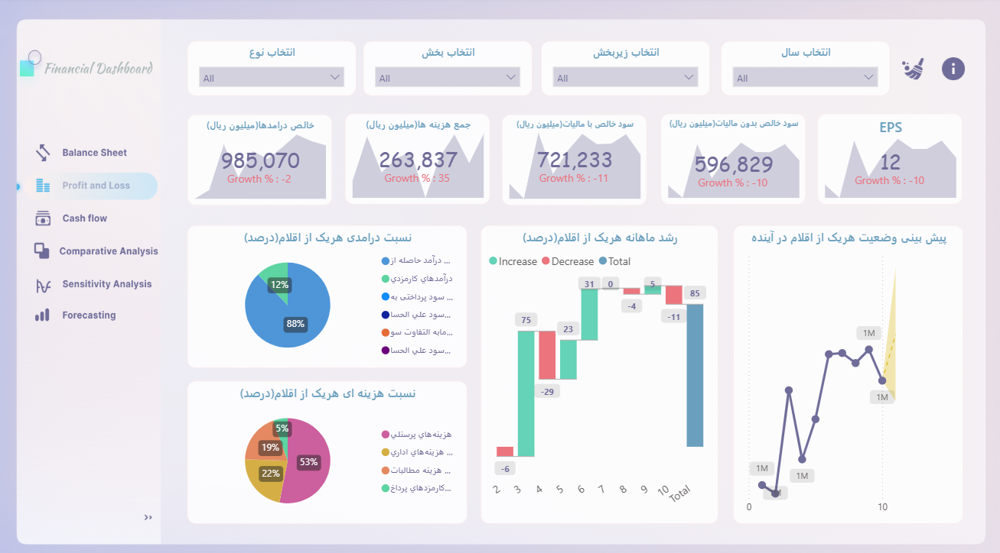

# Financial Analysis Dashboard — Power BI

**Live Dashboard:** [View in Power BI Service](https://app.powerbi.com/view?r=eyJrIjoiZWFmMzU2NzMtZjRjMS00OGRiLTk1YjktOTliNjU3MDdlYjg2IiwidCI6IjljNTRkZmMyLTMxMTktNDVlMC1hYTIzLWE5Nzg5ZDZiNzIyOCIsImMiOjEwfQ==)

This repository provides a detailed overview of a **Financial Analysis Dashboard** built in **Power BI**.  
The dashboard covers **balance sheet, income statement (P&L), cash flow, forecasting, and sensitivity analysis**, helping businesses and analysts gain actionable insights into their financial performance.

---

## Dashboard Objectives
- Provide a **holistic financial overview** in one dashboard.
- Track profitability, liquidity, solvency, and efficiency using KPIs.
- Support **forecasting and scenario analysis** for decision-making.
- Deliver **data-driven insights** to executives, investors, and stakeholders.

---

## Dashboard Pages & Insights

### 1. **Balance Sheet Analysis**
- Assets, liabilities, and equity breakdown.
- Key ratios: current ratio, quick ratio, debt-to-equity.
- Trend analysis for financial position over time.

### 2. **Income Statement (P&L)**
- Revenue, cost of goods sold, gross profit, operating expenses, and net income.
- KPIs: operating margin, net profit margin, EBITDA.
- Comparative view (YoY, QoQ) for revenue and profit trends.

### 3. **Cash Flow Analysis**
- Cash inflows and outflows from operating, investing, and financing activities.
- Free cash flow calculation.
- Liquidity indicators and short-term solvency measures.

### 4. **Forecasting & Projections**
- Revenue and expense projections under different growth scenarios.
- Forecast KPIs: expected EBITDA, net income, and free cash flow.
- Time-series and regression models applied for forward-looking analysis.

### 5. **Sensitivity & Scenario Analysis**
- What-if analysis for changes in key variables (sales growth, cost inflation, interest rates).
- Sensitivity of net income and cash flow to market shocks.
- Scenario planning: base case, best case, and worst case outcomes.

### 6. **Financial KPIs Dashboard**
- ROA, ROE, ROI, EPS, and dividend payout ratio.
- Working capital metrics (DIO, DSO, DPO, cash conversion cycle).
- Comprehensive scorecard for stakeholders and decision-makers.

---

## Tools & Technologies
- **Power BI** for visualization and interactive analysis.
- **Excel/SQL** for data preprocessing and modeling.
- Data: simulated/aggregated financial datasets for demonstration purposes.

---

## How to Use
1. Open the **[Live Dashboard](https://app.powerbi.com/view?r=eyJrIjoiZWFmMzU2NzMtZjRjMS00OGRiLTk1YjktOTliNjU3MDdlYjg2IiwidCI6IjljNTRkZmMyLTMxMTktNDVlMC1hYTIzLWE5Nzg5ZDZiNzIyOCIsImMiOjEwfQ==)**.
2. Navigate between pages using tabs: *Balance Sheet*, *P&L*, *Cash Flow*, *Forecasts*, *Sensitivity Analysis*, *KPIs*.
3. Use slicers and filters to explore different time periods, business units, or scenarios.

---

## 📷 Sample Screenshots
*(replace with your uploaded screenshots in the `assets/` folder)*

### Balance Sheet

### Income Statement

---

##  Notes
- This dashboard is intended for **educational and portfolio purposes**.  
- Data is **simulated/anonymized** for demonstration.  
- For real-world use, connect the dashboard to your **ERP, accounting software, or data warehouse**.
